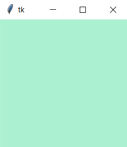

.. note::

    colorir is still in its early days and slight modifications to the API may happen between versions.

What is colorir?
----------------

colorir is a package developed to unify your workflow with colors across different projects.

With colorir you can:

- Create palettes of colors you like to use in your different projects;
- Pass color values directly as input for other graphical or web frameworks;
- Have access to a curated selection of unique color palettes;
- Easily convert between different color systems and formats;
- Create gradients between colors and sample from them;
- Easily visualize swatches of colors in the terminal;
- And much more!

colorir was designed to be your best friend when dealing with colors so that you won't ever need to write this kind of code again:

.. code-block:: python

    BLACK = (0, 0, 0)
    WHITE = (255, 255, 255)
    CSS_ALICEBLUE = (240, 248, 255)
    COOL_PURPLE = (11, 0, 51)
    MY_FAVORITE_GREEN = (113, 180, 141)
    TOP_NOTCH_RED = (131, 34, 50)
    # ... unnecessarily long and ugly list of colors

Getting Started
---------------

Getting started with colorir can be as simple as:

.. code-block:: python

    sky = Palette.load("sky")  # Loads the sky palette
    sky_grad = PolarGrad([sky.sunrise, sky.highnoon])  # Creates a gradient from "sunrise" to "highnoon"
    swatch(sky)
    swatch(sky_grad)

This code should print both the palette and the gradient directly in your terminal:

.. image:: docs/source/images/readme_sky.png

Now let's see how colorir can be used along other frameworks!

.. code-block:: python

    import tkinter as tk

    colors = Palette.load()  # Load colors

    win = tk.Tk()
    win.configure(bg=colors.magicmint)  # Set background to 'magicmint' color
    win.mainloop()

The power of colorir comes from the fact that you can adjust it to work seamlessly with almost any graphical or web framework, not only tkinter!

For more information (including use-cases and examples), see colorir's documentation `here <https://colorir.readthedocs.io/en/latest/>`_.