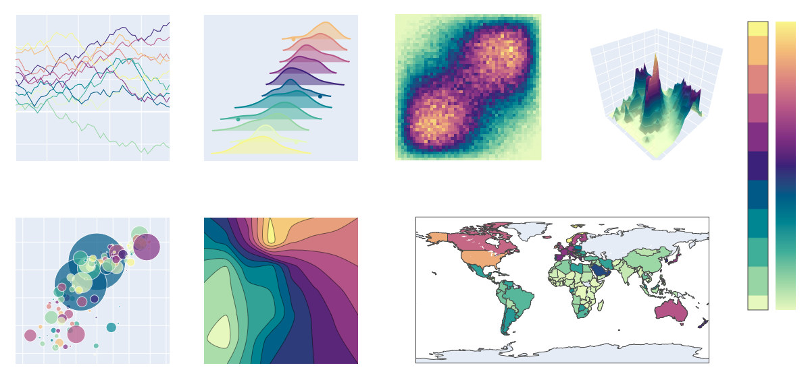
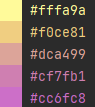
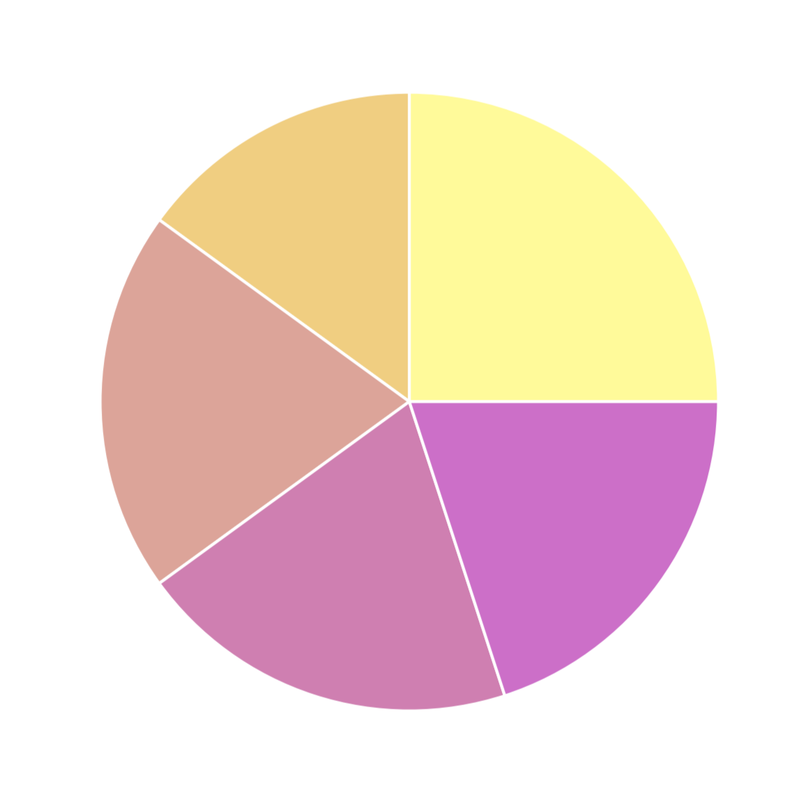

Colorir
=======

What is colorir?
----------------

colorir is a package used to create and manipulate palettes and colors.
What makes colorir different from other similar packages like `colour <https://pypi.org/project/colour/>`_ and
`palettable <https://pypi.org/project/palettable/>`_ is that colorir focuses on personalization and interoperability:
you can create your own color palettes and use them with any other python package such as matplotlib, tkinter
or flask.

Main features
-------------

- Create color schemes and save them to use in different projects
- Interpolate colors in different formats (such as RGB, CIELab etc) to make gradients and color maps
- Have access to a curated selection of unique color palettes and color names
- Easily visualize swatches of colors in the terminal

Getting started
---------------

It is very easy to create an original and attractive color palette with colorir:

.. code-block:: python

    import colorir as cl
    grad = cl.PolarGrad(["ffff00", "ff00ff"])  # Creates a gradient from yellow to magenta
    palette = cl.StackPalette(grad.n_colors(5))  # Samples 5 colors along the gradient and creates a palette with them
    palette *= cl.HCLab(1, 0.5, 1)  # Desaturates the palette 50% to get a more pleasing look
    cl.swatch(palette)  # Shows the palette we created in the terminal

colorir also works seamlessly with other python packages and you don't have to convert colorir objects to pass
them as input to other frameworks:

.. code-block:: python

    import matplotlib.pyplot as plt

    plt.pie([0.25, 0.15, 0.20, 0.20, 0.20], colors=palette)
    plt.show()

For more information (including use-cases and examples), see colorir's documentation `here <https://colorir.readthedocs.io/en/latest/>`_.
