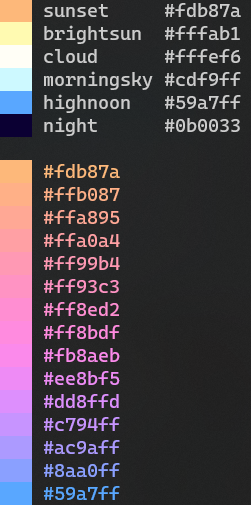
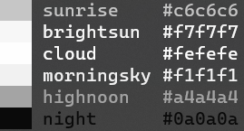

Colorir
=======

.. image:: docs/source/images/read_mepalette_picker.png
    :width: 1000px

.. note::

    colorir is still in its early days and slight modifications to the API may happen between versions.

What is colorir?
----------------

colorir is a package that allows users to manipulate colors and palettes.

With colorir you can:

- Create palettes and save them to use in different projects;
- Have access to a curated selection of unique color palettes and color names;
- Easily convert between different color systems and formats;
- Create gradients between colors and sample from them;
- Easily visualize swatches of colors in the terminal;
- Pass color values directly as input for other graphical or web frameworks;
- And more!

colorir was designed to be your best friend when dealing with colors so that you won't ever need to write this kind of code again:

.. code-block:: python

    BLACK = (0, 0, 0)
    WHITE = (255, 255, 255)
    CSS_ALICEBLUE = (240, 248, 255)
    BACKGROUND_COLOR = (11, 0, 51)
    FONT_COLOR = (113, 180, 141)
    LINE_PLOT_COLOR = (131, 34, 50)
    # ... long and ugly list of colors

Getting Started
---------------

Getting started with colorir can be as simple as:

.. code-block:: python

    sky = Palette.load("sky")  # Loads a previously created palette called sky
    sky_grad = PolarGrad([sky.sunrise, sky.highnoon])  # Creates a gradient from the color "sunrise" to the color "highnoon"
    swatch(sky)  # Shows colorir objects in the terminal
    swatch(sky_grad)

This code should print both the palette and the gradient directly in your terminal:

Colorir can be used to interpolate and manipulate colors in many different color systems,
such as CIELab and HCLab (LCHab).

Now let's make a gray scale version of the sky palette and save it to use later on
another project:

.. code-block:: python

    gray_sky = sky.grayscale()
    gray_sky.save("gray_sky")

Now the gray_sky palette can be loaded with from a different script:

.. code-block:: python

    gray_sky = Palette.load("gray_sky")
    swatch(gray_sky)

For more information (including use-cases and examples), see colorir's documentation `here <https://colorir.readthedocs.io/en/latest/>`_.