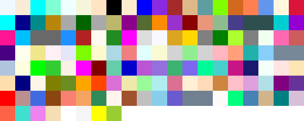
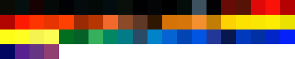

=================
Built-in Palettes
=================

These are built-in palettes that come with colorir by default.

Some of the following palettes have named colors (considered palettes), while in others colors are unnamed (considered stack palettes). After the name of each palette, it is indicated which type it belongs to, and therefore whether it should be loaded with :meth:`Palette.load() <colorir.palette.Palette.load()>` or :meth:`StackPalette.load() <colorir.palette.StackPalette.load()>`.

Essentials
----------

Palettes that provide access to commonly used colors by name.

basic - *palette*
+++++++++++++++++

rainbow - *palette*
+++++++++++++++++++

    
css - *palette*
+++++++++++++++

Web colors of CSS and HTML.

Birds of Brazil
---------------

Palettes that pay homage to the beautiful compositions painted in the feathers of birds native to my home country, Brazil.

precious_tanager - *stack palette*
++++++++++++++++++++++++++++++++++

Colors of the south-american *Tangara preciosa*.

scarlet_macaw - *stack palette*
+++++++++++++++++++++++++++++++

Colors of the parrot *Ara macao*.

toco_toucan - *stack palette*
+++++++++++++++++++++++++++++

Colors of the largest species of toucan, *Ramphastos toco*.

hyacinth_macaw - *stack palette*
++++++++++++++++++++++++++++++++

Colors of the parrot *Anodorhynchus hyacinthinus*.

Originals
---------

Palettes created by me that don't fit other categories.

carnival - *stack palette*
++++++++++++++++++++++++++

Similarly to `spectral`_ spans over a wide span of hue values, making it a good fit for categorical data.

.. _passion:

passion - *palette*
+++++++++++++++++++

Complements the `peace`_ palette. Take a moment to look at the name of the colors of these palettes, they took a while to come up with!

.. _peace:

peace - *palette*
+++++++++++++++++

Complements the `passion`_ palette.

sky - *palette*
+++++++++++++++

Take a look at the sky! Its colors have inspired many poets and painters throughout history.

mystic_forest - *palette*
+++++++++++++++++++++++++

fire - *palette*
++++++++++++++++

Colors inspired by the many aspects of flame.

world_flags - *palette*
+++++++++++++++++++++++

Colors picked from country flags.

pantone_years - *palette*
+++++++++++++++++++++++++

.. attention::

    Do not rely on the size (length) of this palette in your code. It is bound to change every year when a new color of the year is released by Pantone.

Colors awarded as `color of the year <https://www.pantone.com/articles/past-colors-of-the-year>`_ by Pantone.

pigments - *palette*
++++++++++++++++++++

Colors derived from `pigments <https://colourlex.com/pigments/pigments-colour/>`_.

Color Brewer
------------

Palettes extracted from the amazing `Color Brewer project <https://colorbrewer2.org/>`_.

accent - *palette*
++++++++++++++++++

dark2 - *palette*
+++++++++++++++++

paired - *palette*
++++++++++++++++++

pastel1 - *palette*
+++++++++++++++++++

pastel2 - *palette*
+++++++++++++++++++

set1 - *palette*
++++++++++++++++

set2 - *palette*
++++++++++++++++

set3 - *palette*
++++++++++++++++

.. _spectral:

spectral - *stack palette*
++++++++++++++++++++++++++

blues - *stack palette*
+++++++++++++++++++++++

greens - *stack palette*
++++++++++++++++++++++++

greys - *stack palette*
+++++++++++++++++++++++

oranges - *stack palette*
+++++++++++++++++++++++++

.. image:: images/palettes/oranges.png

purples - *stack palette*
+++++++++++++++++++++++++

reds - *stack palette*
++++++++++++++++++++++

brbg - *stack palette*
++++++++++++++++++++++

bugn - *stack palette*
++++++++++++++++++++++

bupu - *stack palette*
++++++++++++++++++++++

gnbu - *stack palette*
++++++++++++++++++++++

orrd - *stack palette*
++++++++++++++++++++++

piyg - *stack palette*
++++++++++++++++++++++

prgn - *stack palette*
++++++++++++++++++++++

pubu - *stack palette*
++++++++++++++++++++++

pubugn - *stack palette*
++++++++++++++++++++++++

puor - *stack palette*
++++++++++++++++++++++

purd - *stack palette*
++++++++++++++++++++++

rdbu - *stack palette*
++++++++++++++++++++++

rdgy - *stack palette*
++++++++++++++++++++++

rdpu - *stack palette*
++++++++++++++++++++++

rdylbu - *stack palette*
++++++++++++++++++++++++

rdylgn - *stack palette*
++++++++++++++++++++++++

ylgn - *stack palette*
++++++++++++++++++++++

ylgnbu - *stack palette*
++++++++++++++++++++++++

ylorbr - *stack palette*
++++++++++++++++++++++++

ylorrd - *stack palette*
++++++++++++++++++++++++

Carto
-----

Palettes from the Carto project.

burg - *stack palette*
++++++++++++++++++++++

burgyl - *stack palette*
++++++++++++++++++++++++

redor - *stack palette*
+++++++++++++++++++++++

.. image:: images/palettes/redor.png

oryel - *stack palette*
+++++++++++++++++++++++

peach - *stack palette*
+++++++++++++++++++++++

pinkyl - *stack palette*
++++++++++++++++++++++++

mint - *stack palette*
++++++++++++++++++++++

blugrn - *stack palette*
++++++++++++++++++++++++

darkmint - *stack palette*
++++++++++++++++++++++++++

emrld - *stack palette*
+++++++++++++++++++++++

ag_grnyl - *stack palette*
++++++++++++++++++++++++++

bluyl - *stack palette*
+++++++++++++++++++++++

teal - *stack palette*
++++++++++++++++++++++

tealgrn - *stack palette*
+++++++++++++++++++++++++

purp - *stack palette*
++++++++++++++++++++++

purpor - *stack palette*
++++++++++++++++++++++++

magenta - *stack palette*
+++++++++++++++++++++++++

sunset - *stack palette*
++++++++++++++++++++++++

sunsetdark - *stack palette*
++++++++++++++++++++++++++++

ag_sunset - *stack palette*
+++++++++++++++++++++++++++

.. image:: images/palettes/ag_sunset.png

brwnyl - *stack palette*
++++++++++++++++++++++++

armyrose - *stack palette*
++++++++++++++++++++++++++

fall - *stack palette*
++++++++++++++++++++++

geyser - *stack palette*
++++++++++++++++++++++++

temps - *stack palette*
+++++++++++++++++++++++

tealrose - *stack palette*
++++++++++++++++++++++++++

tropic - *stack palette*
++++++++++++++++++++++++

earth - *stack palette*
+++++++++++++++++++++++

antique - *stack palette*
+++++++++++++++++++++++++

bold - *stack palette*
++++++++++++++++++++++

pastel - *stack palette*
++++++++++++++++++++++++

prism - *stack palette*
+++++++++++++++++++++++

safe - *stack palette*
++++++++++++++++++++++

vivid - *stack palette*
+++++++++++++++++++++++

Matplotlib
----------

Palettes from `matplotlib <https://matplotlib.org/stable/index.html>`_.

"rainbow" was renamed to "mpl_rainbow" for compatibility reasons.

tab10 - *palette*
+++++++++++++++++

tab20 - *stack palette*
+++++++++++++++++++++++

tab20b - *stack palette*
++++++++++++++++++++++++

tab20c - *stack palette*
++++++++++++++++++++++++

magma - *stack palette*
+++++++++++++++++++++++

inferno - *stack palette*
+++++++++++++++++++++++++

plasma - *stack palette*
++++++++++++++++++++++++

viridis - *stack palette*
+++++++++++++++++++++++++

cividis - *stack palette*
+++++++++++++++++++++++++

twilight - *stack palette*
++++++++++++++++++++++++++

twilight_shifted - *stack palette*
++++++++++++++++++++++++++++++++++

wistia - *stack palette*
++++++++++++++++++++++++

afmhot - *stack palette*
++++++++++++++++++++++++

autumn - *stack palette*
++++++++++++++++++++++++

.. image:: images/palettes/autumn.png

binary - *stack palette*
++++++++++++++++++++++++

bone - *stack palette*
++++++++++++++++++++++

bwr - *stack palette*
+++++++++++++++++++++

cool - *stack palette*
++++++++++++++++++++++

coolwarm - *stack palette*
++++++++++++++++++++++++++

copper - *stack palette*
++++++++++++++++++++++++

cubehelix - *stack palette*
+++++++++++++++++++++++++++

gist_earth - *stack palette*
++++++++++++++++++++++++++++

gist_gray - *stack palette*
+++++++++++++++++++++++++++

gist_heat - *stack palette*
+++++++++++++++++++++++++++

gist_yarg - *stack palette*
+++++++++++++++++++++++++++

.. image:: images/palettes/gist_yarg.png

gray - *stack palette*
++++++++++++++++++++++

hot - *stack palette*
+++++++++++++++++++++

hsv - *stack palette*
+++++++++++++++++++++

jet - *stack palette*
+++++++++++++++++++++

turbo - *stack palette*
+++++++++++++++++++++++

ocean - *stack palette*
+++++++++++++++++++++++

pink - *stack palette*
++++++++++++++++++++++

seismic - *stack palette*
+++++++++++++++++++++++++

spring - *stack palette*
++++++++++++++++++++++++

summer - *stack palette*
++++++++++++++++++++++++

terrain - *stack palette*
+++++++++++++++++++++++++

winter - *stack palette*
++++++++++++++++++++++++

rocket - *stack palette*
++++++++++++++++++++++++

mako - *stack palette*
++++++++++++++++++++++

icefire - *stack palette*
+++++++++++++++++++++++++

vlag - *stack palette*
++++++++++++++++++++++

flare - *stack palette*
+++++++++++++++++++++++

crest - *stack palette*
+++++++++++++++++++++++

mpl_rainbow - *stack palette*
+++++++++++++++++++++++++++++

Seaborn
-------

Palettes from `seaborn <https://seaborn.pydata.org/index.html>`_.

deep - *stack palette*
++++++++++++++++++++++

muted - *stack palette*
+++++++++++++++++++++++

pastel - *stack palette*
++++++++++++++++++++++++

bright - *stack palette*
++++++++++++++++++++++++

dark - *stack palette*
++++++++++++++++++++++

colorblind - *stack palette*
++++++++++++++++++++++++++++

Plotly
------

Palettes from `plotly <https://plotly.com/>`_.

"icefire" was renamed to "plotly_icefire" for compatibility reasons.

plotly - *stack palette*
++++++++++++++++++++++++

d3 - *stack palette*
++++++++++++++++++++

g10 - *stack palette*
+++++++++++++++++++++

t10 - *stack palette*
+++++++++++++++++++++

alphabet - *stack palette*
++++++++++++++++++++++++++

dark24 - *stack palette*
++++++++++++++++++++++++

light24 - *stack palette*
+++++++++++++++++++++++++

blackbody - *stack palette*
+++++++++++++++++++++++++++

bluered - *stack palette*
+++++++++++++++++++++++++

electric - *stack palette*
++++++++++++++++++++++++++

plotly3 - *stack palette*
+++++++++++++++++++++++++

algae - *stack palette*
+++++++++++++++++++++++

amp - *stack palette*
+++++++++++++++++++++

deep - *stack palette*
++++++++++++++++++++++

dense - *stack palette*
+++++++++++++++++++++++

haline - *stack palette*
++++++++++++++++++++++++

.. image:: images/palettes/haline.png

ice - *stack palette*
+++++++++++++++++++++

matter - *stack palette*
++++++++++++++++++++++++

solar - *stack palette*
+++++++++++++++++++++++

speed - *stack palette*
+++++++++++++++++++++++

tempo - *stack palette*
+++++++++++++++++++++++

thermal - *stack palette*
+++++++++++++++++++++++++

turbid - *stack palette*
++++++++++++++++++++++++

picnic - *stack palette*
++++++++++++++++++++++++

.. image:: images/palettes/picnic.png

portland - *stack palette*
++++++++++++++++++++++++++

balance - *stack palette*
+++++++++++++++++++++++++

curl - *stack palette*
++++++++++++++++++++++

delta - *stack palette*
+++++++++++++++++++++++

oxy - *stack palette*
+++++++++++++++++++++

edge - *stack palette*
++++++++++++++++++++++

phase - *stack palette*
+++++++++++++++++++++++

mrybm - *stack palette*
+++++++++++++++++++++++

mygbm - *stack palette*
+++++++++++++++++++++++

plotly_icefire - *stack palette*
++++++++++++++++++++++++++++++++

