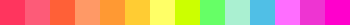
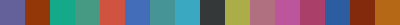

Built-in Palettes
=================

The following palettes come built in colorir and can be loaded with the :meth:`Palette.load() <colorir.palette.Palette.load()>` method.

The ellipsis symbol indicates the palette is bigger but couldn't fit here.

Essentials
----------

Palettes that provide access to commonly used colors.

basic:

.. image:: images/palettes/basic.png
    :height: 25px

rainbow:

.. image:: images/palettes/rainbow.png
    :height: 25px
    
css:

.. image:: images/palettes/css.png
    :height: 25px

Crayons
-------

Palettes that have been release as crayon sets in the past.
    
fluorescent:

    
gem_tones:

    
heads_n_tails:

    
magic_scent:

    
metallic_fx:

    
silly_scents:

    
silver_swirls:

Other
-----

Palettes that don't necessarily fit a category.

world_flags:

.. image:: images/palettes/world_flags.png
    :height: 25px

mystic_forest:

.. image:: images/palettes/mystic_forest.png
    :height: 25px

pantone_years:

.. image:: images/palettes/pantone_years.png
    :height: 25px
    