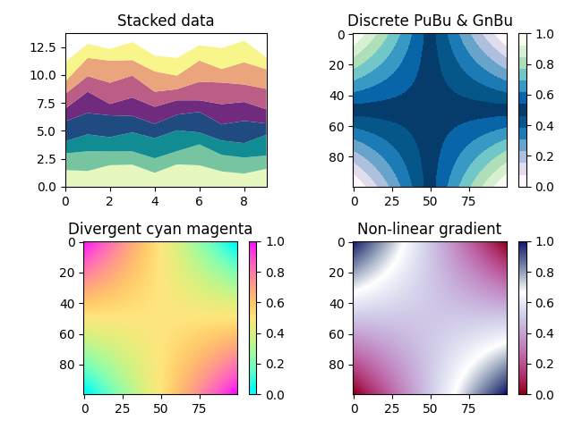
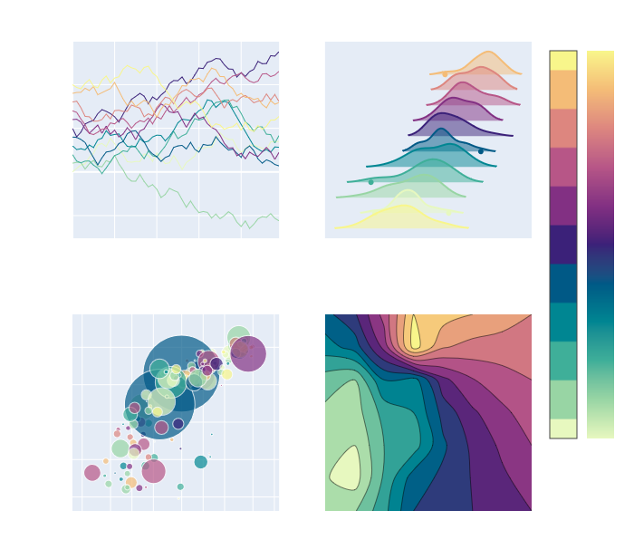
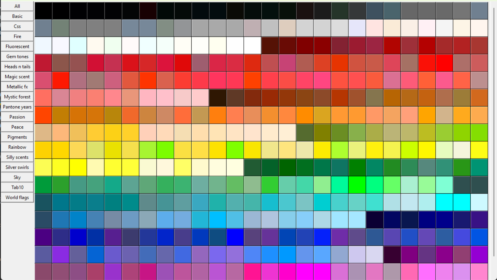

Examples
========

After installing colorir, example applications can be executed from the shell with:

.. code-block:: shell

	$ python -m colorir <app>

Where `app` is one of:

- `custom_palettes`_
- `color_wheel`_
- `palette_picker`_
- `color_picker`_

.. _custom_palettes:

Custom palettes for plotting
----------------------------

In this example we will use colorir to create custom color palettes
and gradients and then use them to plot some data.

.. literalinclude:: ../../colorir/examples/custom_palettes.py

.. _color_wheel:

Color Wheel with Kivy
---------------------

A color wheel viewer (not a color picker) showcasing :class:`~colorir.gradient.Grad`.

.. literalinclude:: ../../colorir/examples/color_wheel.py

.. _palette_picker:

Palette Picker with Plotly
--------------------------

A plotly application used to test palettes with different data types.

.. literalinclude:: ../../colorir/examples/palette_picker.py

.. _color_picker:

Color Picker with Tkinter
-------------------------

A simple color picker that shows all the palettes available on our current directory (+ the built-in palettes)
and copies the names of a color to the clipboard when we click on it.

Just like with any other example, the color picker can be executed with:

.. code-block:: shell

	$ python -m colorir color_picker

.. literalinclude:: ../../colorir/examples/color_picker.py
