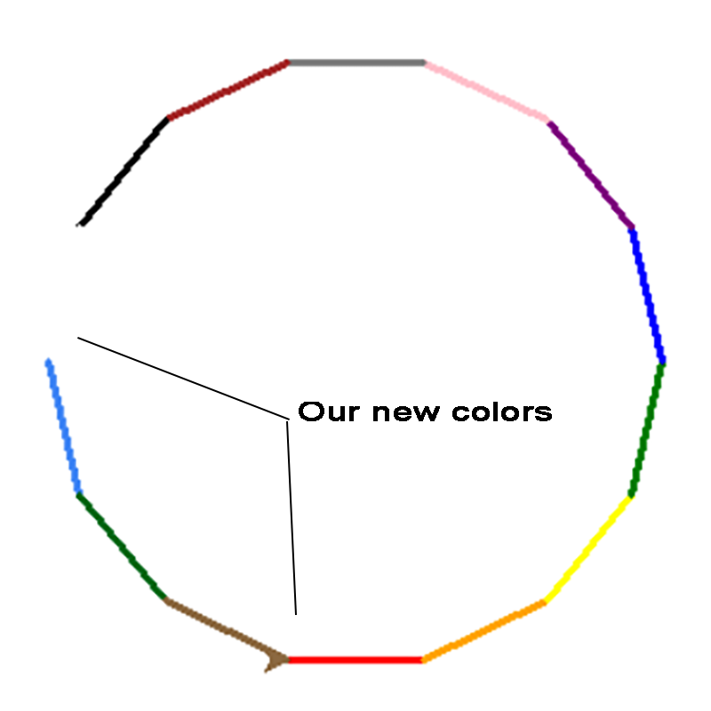
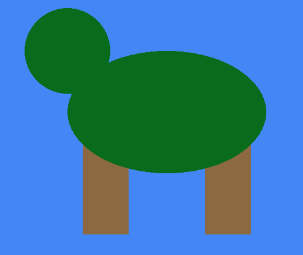

Examples
========

Simple example: Sharing a colors between Turtle and PyGame projects
-------------------------------------------------------------------

In this example we will combine python's turtle package with colorir to draw basic shapes.

For starters, we will load one of the palettes that come with colorir for convenience:

.. code-block:: python

	from colorir import Palette
	colors = Palette.load("basic")

The "basic" palette contains colors like blue, green, black etc.

That's it! We are done and ready to use our basic colors:

.. literalinclude:: ../../examples/simple_turtle_1.py
	:start-after: # Code

You should now hopefully see a red square in your screen.

Let's modify our example to add some of our personal favorite colors to our `colors` palette:

.. code-block:: python

	colors = Palette.load("basic")
	colors.add("dreamblue", "#4287f5")
	colors.add("swampgreen", "#096b1c")
	colors.add("woodbrown", "#8c6941")

This should be enough, now instead of a red square we can draw more interesting stuff:

.. literalinclude:: ../../examples/simple_turtle_2.py
	:start-after: # Code

You should see something resembling this (but with no text):

Ok! We are done with the turtles for right now. We should save our colors so we can use them next time we feel like drawing turtles:

.. code-block:: python

	colors.name = "turtles" # First we give the palette a name
	colors.save() # Then save it

A few weeks latter we suddenly have a brilliant idea: what if we could draw actual turtles, instead of a weird arrow we've been pretending to be a turtle?

But we also would like to keep our colors from the last project since we took so long choosing turtle-fitting colors.

Let's put that on paper with PyGame:

.. literalinclude:: ../../examples/simple_pygame.py
	:start-after: # Code

Ha! And Mom said I wouldn't make money with NFTs...

Anyway, I hope you could get I very basic idea of how to use colorir. For more examples and insights on how to use this package, see the documentation of each module and the other examples bellow.